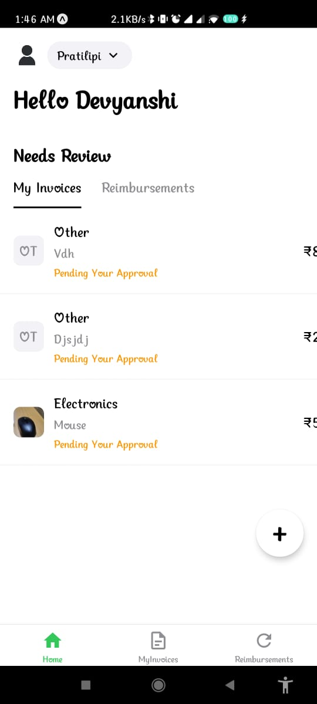
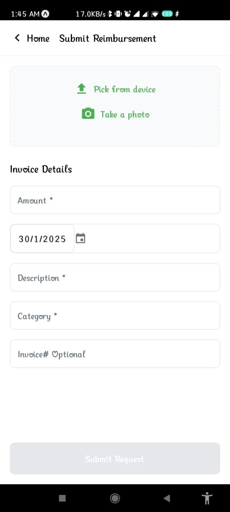
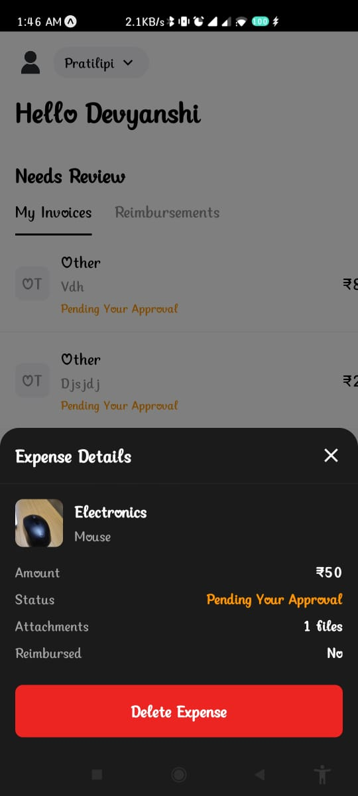

# Reimbursement App

A React Native application for managing reimbursements and invoices. This app allows users to submit reimbursement requests, view their invoices, and manage their expenses efficiently.

## Features

- **Submit Reimbursement**: Users can submit reimbursement requests by providing details such as amount, transaction date, description, category, and uploading supporting documents or images.
- **View Invoices**: Users can view their invoices and filter them based on their status (reimbursed or not reimbursed).
- **Expense Details**: Users can view detailed information about each expense, including the amount, status, description, and attachments.
- **Profile Management**: Users can view and manage their profile information.

## Screenshots





## Installation

1. Clone the repository:

   ```bash
   git clone https://github.com/yourusername/reimbursement-app.git
   ```

2. Navigate to the project directory:

   ```bash
   cd reimbursement-app
   ```

3. Install the dependencies:

   ```bash
   npm install
   ```

4. Start the development server:

   ```bash
   npm start
   ```

## Usage

1. Open the app on your device or emulator.
2. Navigate through the app using the bottom navigation bar.
3. Submit reimbursement requests by filling in the required details and uploading supporting documents.
4. View and manage your invoices and expenses.

## Technologies Used

- **React Native**: A framework for building native apps using React.
- **Expo**: A set of tools and services for building, deploying, and quickly iterating on React Native apps.
- **AsyncStorage**: A simple, unencrypted, asynchronous, persistent, key-value storage system for React Native.
- **React Navigation**: A library for routing and navigation in React Native apps.

## Contributing

Contributions are welcome! If you have any suggestions or improvements, please create an issue or submit a pull request.

## License

This project is licensed under the MIT License. See the [LICENSE](./LICENSE) file for details.

## Contact

If you have any questions or need further assistance, feel free to contact me at [your-email@example.com](mailto:your-email@example.com).

```

```
